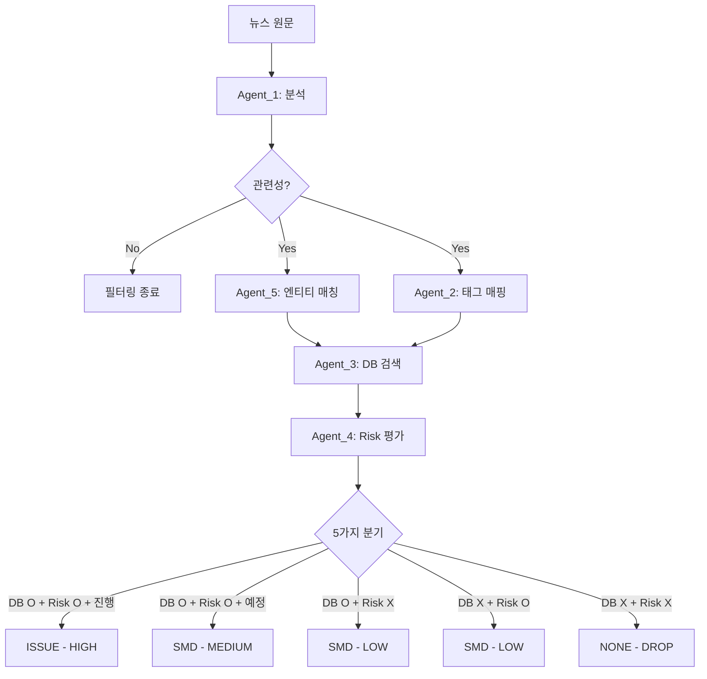

# 비정형 Risk 센싱 Agent 시스템 개요

## 목차
- [시스템 소개](#시스템-소개)
- [아키텍처](#아키텍처)
- [데이터 흐름](#데이터-흐름)
- [주요 모듈](#주요-모듈)
- [기술 스택](#기술-스택)
- [디렉터리 구조](#디렉터리-구조)
- [주요 데이터베이스](#주요-데이터베이스)
- [실행 방법](#실행-방법)

---

## 시스템 소개

비정형 Risk 센싱 Agent는 **뉴스 데이터를 수집하고 분석하여 반도체 공급망 리스크를 자동으로 탐지**하는 AI 기반 시스템입니다.

### 핵심 목표
1. 글로벌 뉴스에서 반도체 공급망 리스크 자동 탐지
2. Risk 발생 가능성과 시점을 평가하여 우선순위 지정
3. 구매 담당자에게 실행 가능한 인사이트 제공

### 주요 특징
- **다단계 파이프라인**: 6개 모듈이 순차적으로 뉴스를 처리
- **LLM 기반 분석**: GPT-4o-mini/GPT-5.5를 활용한 고정확도 분석
- **Knowledge Graph 활용**: 글로벌 공급망 인사이트 기반 엔티티 매칭
- **다중 시나리오 평가**: 복합적 Risk 상황을 여러 관점에서 평가
- **Human-in-the-Loop**: 중요한 판단은 사용자 확인 후 진행

---

## 아키텍처

```
[Knowledge Graph 구축] (사전 단계)
        ↓
[뉴스 원문 입력] (영어/한글)
        ↓
    Agent_1: News Analyzer
    - 번역 (영어 → 한글)
    - 요약 생성
    - 키워드 추출
    - Risk Factor 관련성 판정
        ↓
    (is_relevant=False → 필터링 종료)
        ↓
    ┌───────────────────┴───────────────────┐
    ↓                                       ↓
Agent_5: News Grouper              Agent_2: Tag Mapper
- 엔티티 추출 (LLM)                - 키워드 → 태그 매핑
- KG 엔티티 매칭                   - 신규 EVENT 태그 제안
                                   - HITL 판단
    └───────────────────┬───────────────────┘
                        ↓
            Agent_3: DB Searcher
            - Risk 시나리오 생성
            - SQL 자동 생성
            - 공급망 DB 검색
                        ↓
            Agent_4: Risk Evaluator
            - Risk 평가 (단일/다중 시나리오)
            - 이벤트 시점 분류 (진행형/예정형)
            - 이슈 타입 결정 (5가지 분기)
            - 신규 키워드 제안 (HITL)
                        ↓
        [최종 출력: ISSUE/SMD/NONE + 우선순위]
```

---

## 데이터 흐름

### 전체 파이프라인



### 주요 데이터 필드 변환

| 단계 | 입력 | 출력 |
|------|------|------|
| **Agent_1** | 뉴스 원문 (title, content) | 한글 뉴스, keywords, is_relevant |
| **Agent_5** | 한글 뉴스, keywords | matched_kg_entities |
| **Agent_2** | keywords | mapped_tags, requires_hitl |
| **Agent_3** | mapped_tags | risk_scenarios, generated_sqls, search_results |
| **Agent_4** | search_results, risk_scenarios | is_risk, risk_score, event_timing, issue_type, issue_priority |

---

## 주요 모듈

### 사전 단계: Knowledge Graph 구축
- **문서**: [00-1_INSIGHT_KG_BUILDER.md](00-1_INSIGHT_KG_BUILDER.md)
- **역할**: 글로벌 공급망 인사이트 레포트로 KG 구축
- **도구**: LightRAG, OpenAI GPT-4o-mini
- **출력**: `graph_chunk_entity_relation_normalized.graphml`

### 모듈 1: News Analyzer (Agent_1)
- **문서**: [01_AGENT_1_NEWS_ANALYZER.md](01_AGENT_1_NEWS_ANALYZER.md)
- **역할**: 뉴스 번역, 요약, 키워드 추출, 관련성 판정
- **주요 노드**: translate_to_korean, generate_summary, extract_keywords, filter_false_positive
- **출력**: 한글 뉴스, keywords, is_relevant

### 모듈 2: News Grouper (Agent_5)
- **문서**: [02_AGENT_5_NEWS_GROUPER.md](02_AGENT_5_NEWS_GROUPER.md)
- **역할**: 뉴스 엔티티 추출 및 KG 매칭
- **주요 노드**: validate_input, extract_entities_llm, match_entities_string
- **출력**: matched_kg_entities

### 모듈 3: Tag Mapper (Agent_2)
- **문서**: [03_AGENT_2_TAG_MAPPER.md](03_AGENT_2_TAG_MAPPER.md)
- **역할**: 키워드-태그 매핑, 신규 EVENT 태그 제안
- **주요 노드**: validate_input, analyze_keyword_context, exact_match_tags, verify_mapping_quality, classify_unmatched_keywords, review_event_proposals, aggregate_results
- **출력**: mapped_tags, mapping_quality_score, requires_hitl

### 모듈 4: DB Searcher (Agent_3)
- **문서**: [04_AGENT_3_DB_SEARCHER.md](04_AGENT_3_DB_SEARCHER.md)
- **역할**: Risk 시나리오 생성, SQL 자동 생성, DB 검색
- **주요 노드**: validate_input, generate_risk_scenario, generate_sql, search_db
- **출력**: risk_scenarios, generated_sqls, search_results

### 모듈 5: Risk Evaluator (Agent_4)
- **문서**: [05_AGENT_4_RISK_EVALUATOR.md](05_AGENT_4_RISK_EVALUATOR.md)
- **역할**: Risk 평가, 이벤트 시점 분류, 이슈 타입 결정
- **주요 노드**: validate_input, evaluate_risk_relevance, evaluate_multi_scenarios, aggregate_risk_decision, classify_event_timing, determine_issue_type, recommend_keywords
- **출력**: is_risk, risk_score, event_timing, issue_type, issue_priority, recommended_keywords

---

## 기술 스택

### 프레임워크
- **LangGraph**: 워크플로우 오케스트레이션
- **LightRAG**: Knowledge Graph 구축

### AI 모델
- **OpenAI GPT-4o-mini**: 번역, 요약, 키워드 추출, 태그 분류
- **OpenAI GPT-5.5**: Risk 평가, 이벤트 시점 분류 (추론 특화)
- **text-embedding-3-small**: 벡터 임베딩 (1536차원)

### 데이터베이스
- **SQLite**: 태그 DB, 공급망 DB, 온톨로지 DB, 뉴스 DB
- **NetworkX/GRAPHML**: Knowledge Graph 저장 및 탐색

### 언어 및 라이브러리
- **Python 3.11+**
- **openpyxl**: Excel 파일 처리
- **sqlite3**: DB 연결 및 쿼리

---

## 디렉터리 구조

```
poc-a/
├── dev/
│   ├── insight_kg/                      # KG 구축 스크립트
│   │   ├── insight_kg_builder.py
│   │   ├── insight_kg_entity_normalizer_builder.py
│   │   ├── insight_kg_entity_normalizer_applier.py
│   │   └── insight_kg_relation_categorizer.py
│   │
│   ├── Agent_1_News_Analyzer/           # 모듈 1
│   │   ├── graph.py
│   │   ├── config.py
│   │   ├── prompts.py
│   │   ├── nodes/
│   │   │   ├── translator.py
│   │   │   ├── summary_generator.py
│   │   │   ├── keyword_extractor.py
│   │   │   └── false_positive_filter.py
│   │   └── utils/
│   │
│   ├── Agent_5_News_Grouper/            # 모듈 2
│   │   ├── graph.py
│   │   ├── config.py
│   │   ├── prompts.py
│   │   └── nodes/
│   │
│   ├── Agent_2_Tag_Mapper/              # 모듈 3
│   │   ├── graph.py
│   │   ├── config.py
│   │   ├── prompts.py
│   │   └── nodes/
│   │
│   ├── Agent_3_DB_Searcher/             # 모듈 4
│   │   ├── graph.py
│   │   ├── config.py
│   │   ├── prompts.py
│   │   └── nodes/
│   │
│   └── Agent_4_Risk_Evaluator/          # 모듈 5
│       ├── graph.py
│       ├── config.py
│       ├── prompts.py
│       └── nodes/
│
├── data/
│   ├── NEWS/
│   │   ├── news_intelligence.db         # 뉴스 및 태그 DB
│   │   └── insight_kg/                  # KG 저장소
│   │       └── graph_chunk_entity_relation_normalized.graphml
│   │
│   └── TAG/
│       └── DB_TAG_Risk Factor Pool_vF.xlsx  # Risk Factor 키워드셋
│
├── config/
│   ├── lightrag_entity_extraction_prompt.txt
│   └── lightrag_relation_extraction_prompt.txt
│
└── Markdown/
    └── Module/
        └── Workflow/                    # 이 문서
```

---

## 주요 데이터베이스

### 1. news_intelligence.db

| 테이블명 | 설명 |
|----------|------|
| **NEWS_MASTER** | 뉴스 원문 정보 (title, content, url, pub_date) |
| **NEWS_KEYWORD_EXTRACTION** | Agent_1이 추출한 키워드 |
| **NEWS_TAG_MAP** | Agent_2가 매핑한 태그 |
| **NEWS_ENTITY_EXTRACTION** | Agent_5가 추출한 엔티티 |
| **NEWS_RISK_EVALUATION** | Agent_4의 Risk 평가 결과 |
| **TAG_MASTER** | 태그 정보 (tag_id, tag_name, tag_type) |
| **TAG_KEYWORD_MAP** | 태그별 키워드 목록 |
| **AGENT_DB_SEARCH_LOG** | Agent_3의 SQL 생성 및 검색 로그 |
| **NEWS_GROUP** | 뉴스 그룹 정보 |
| **NEWS_GROUP_MEMBERSHIP** | 뉴스-그룹 매핑 |
| **INSIGHT_REPORT_MASTER** | 글로벌 공급망 인사이트 레포트 |

### 2. supply_chain.db (Agent_3 검색 대상)

| 테이블명 | 설명 |
|----------|------|
| **SUPPLIER_MASTER** | 협력사 마스터 |
| **SITE_MASTER** | 생산지/공장 마스터 |
| **MATERIAL_MASTER** | 자재 마스터 |
| **PART_MASTER** | 부품 마스터 |
| *기타 공급망 관계 테이블* | 협력사-자재, 협력사-생산지 등 |

### 3. ontology.db (Agent_3 온톨로지)

| 테이블명 | 설명 |
|----------|------|
| **ONTOLOGY_RULES** | 도메인 규칙 (태그 → 검색 전략) |
| **SEARCH_STRATEGIES** | SQL 템플릿 정의 |

### 4. graph_chunk_entity_relation_normalized.graphml (KG)

- **노드**: 엔티티 (Country, Company, Material, Policy, Event, Location, Technology, Organization)
- **엣지**: 관계 (CAUSAL, POLICY_REGULATION, SUPPLY, GEOGRAPHIC, DESCRIPTIVE)
- **용도**: Agent_5의 엔티티 매칭

---

## 실행 방법

### 사전 준비

1. **환경 설정**
   ```bash
   cd C:\Users\seokjjeong\Desktop\NSRM_Risk-Sensing\poc-a
   python -m venv .venv
   .venv\Scripts\activate
   pip install -r requirements.txt
   ```

2. **환경 변수 설정** (.env 파일)
   ```
   OPENAI_API_KEY=your_api_key_here
   ```

3. **Knowledge Graph 구축** (최초 1회)
   ```bash
   python dev/insight_kg/insight_kg_builder.py
   ```

### 모듈별 개별 실행

각 모듈은 독립적으로 실행 가능합니다.

```bash
# Agent_1: 뉴스 분석
python dev/Agent_1_News_Analyzer/scripts/run_analyzer.py

# Agent_2: 태그 매핑
python dev/Agent_2_Tag_Mapper/scripts/run_tag_mapper.py

# Agent_3: DB 검색
python dev/Agent_3_DB_Searcher/scripts/run_db_searcher.py

# Agent_4: Risk 평가
python dev/Agent_4_Risk_Evaluator/scripts/run_risk_evaluator.py

# Agent_5: 엔티티 매칭
python dev/Agent_5_News_Grouper/scripts/run_news_grouper.py
```

### 통합 파이프라인 실행

```bash
# 전체 파이프라인 순차 실행
python dev/scripts/run_full_pipeline.py
```

---

## 문서 네비게이션

- **다음**: [Knowledge Graph 구축 (00-1)](00-1_INSIGHT_KG_BUILDER.md)
- **모듈 문서**:
  - [Agent_1: News Analyzer](01_AGENT_1_NEWS_ANALYZER.md)
  - [Agent_5: News Grouper](02_AGENT_5_NEWS_GROUPER.md)
  - [Agent_2: Tag Mapper](03_AGENT_2_TAG_MAPPER.md)
  - [Agent_3: DB Searcher](04_AGENT_3_DB_SEARCHER.md)
  - [Agent_4: Risk Evaluator](05_AGENT_4_RISK_EVALUATOR.md)
- **실행 예시**: [99_EXAMPLES.md](99_EXAMPLES.md)

---

**작성일**: 2026-07-12  
**버전**: 1.0  
**문서 작성자**: Claude Code
